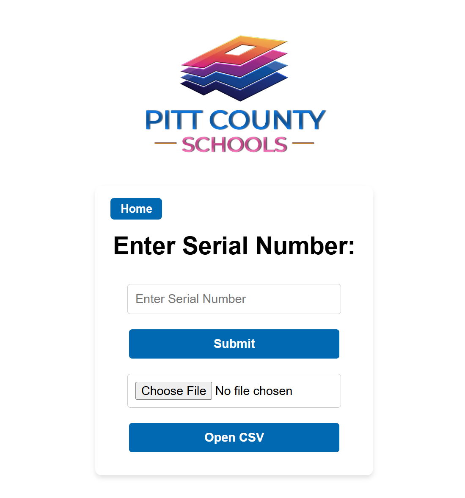

# CSV Reader 2.0
## Tech Stack


## What is CSV Reader 2.0?
A webpage that allows for easier scanning, storage, and exportation of iPad information using data stored in a local database.

## Installation
If you want to view your database (db), you will need [DB Browser](https://sqlitebrowser.org/). You will need the file 'funding_database.db' to be present on your system for the table to be created. The table is created for you once you run the program. <br>
You must have [python](https://www.python.org/downloads/) installed. I won't be going over how to install python here. <br>
Once you have it installed, You can run this program by being in the directory where "CSV Reader 2.0" is saved.<br>
Run:
```console
foo@bar:~$ python flaskApp.py
```
An http link will be displayed, go to that link and you will be shown the page. <br>
If you ever want to stop the local server press 'CTRL+C'.

## Usage 
**What does it do?** <br>
It allows you to open a CSV file that contains previous data you or someone else has collected. This specifically can be used when having to sort devices and having to save their information.<br>
As you enter a serial number of a device, order_number, and model, the program will search your db for any previous order numbers that match. It will then return its funding source. You can make changes before you finally enter it as well. 
> [!NOTE]
> You are responsible for making sure your previous data is clean. In the future, I would like to have it search for any discrepancies.

Data you entered will also be stored in a seperate CSV file. This is done so you know what devices you entered for that session. You can continue to keep adding onto it or save it externally and import it in. 'new_info.csv' will be created on your behalf if that file is not found.
### Importing CSV
At the moment, when importing in CSV data, the colomns must contain: serial_number, model, order_number, and funding_source. The order in which they are in shouldn't matter but the names do. <br>
When you import data, the file will be saved locally on your device and will also be stored in your database. <br>
> [!NOTE]
> Updating the database is currently commented out for bug testing. However, devices will still be saved locally.

When devices are stored in your db, searching for whether or not a order_number exists is quick. If one isn't found (or the db doesn't have information) then you would have to manually enter it.


### Preview



If a order number is found, this page would not be seen:

Last page seen before submitting


### TODO:
- Possible implementation of Docker
- Show how much data is read when CSV is imported
